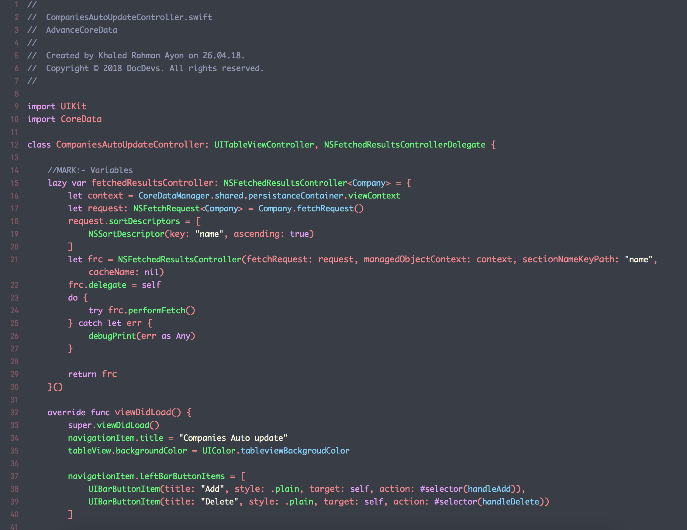

# MyXcodeTheme
My Xcode theme - I call it Vamp Theme

<h1>Installing manually</h1>
You can also choose to do things manually if you want:

Clone this repo:
$ git clone https://github.com/ayon1911/MyXcodeTheme.git

Create a folder at this path if it doesn't exist already:
~/Library/Developer/Xcode/UserData/FontAndColorThemes
Copy the file SundellsColors.xccolortheme into the above folder.

Download the latest release of Source Code Pro from its repo.

Should've used the install script, right? 😉
